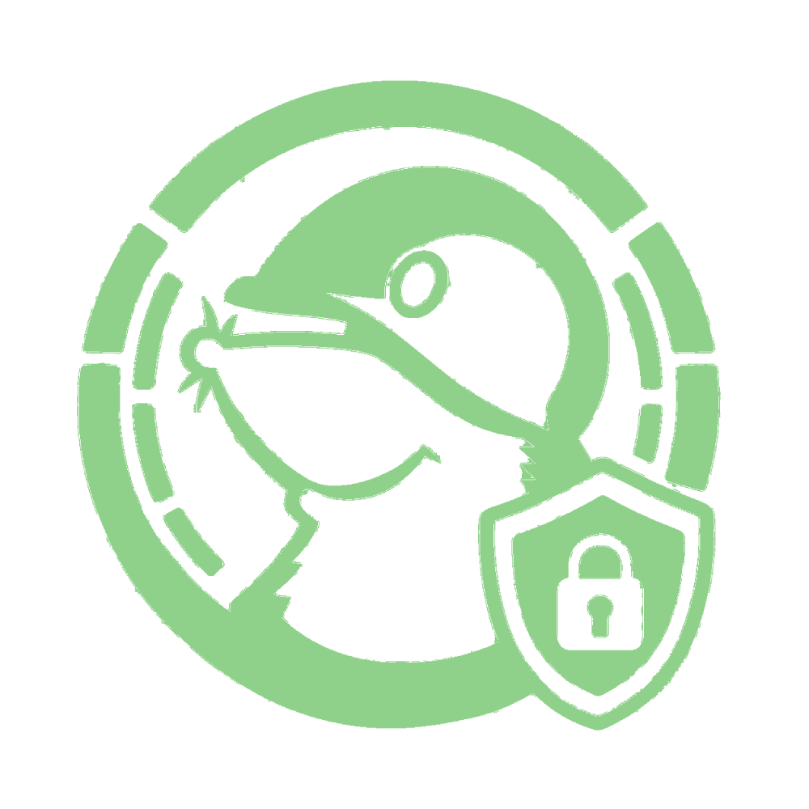
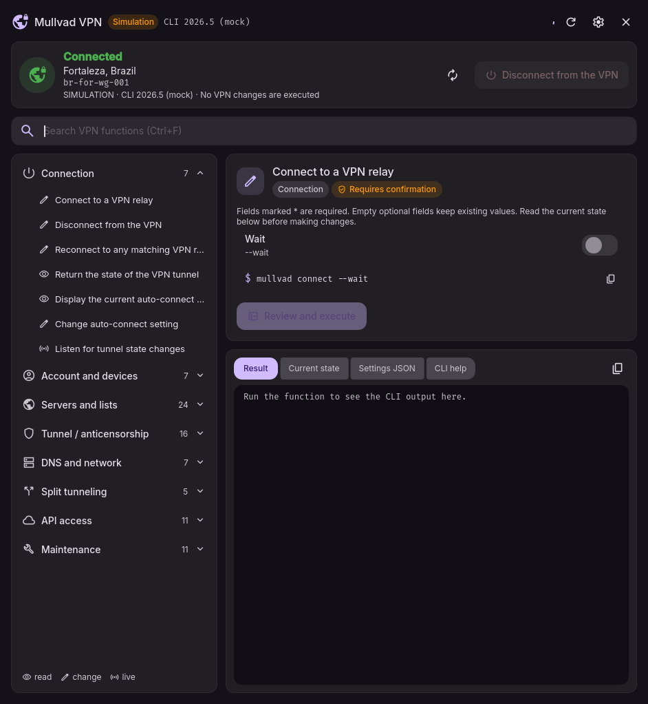
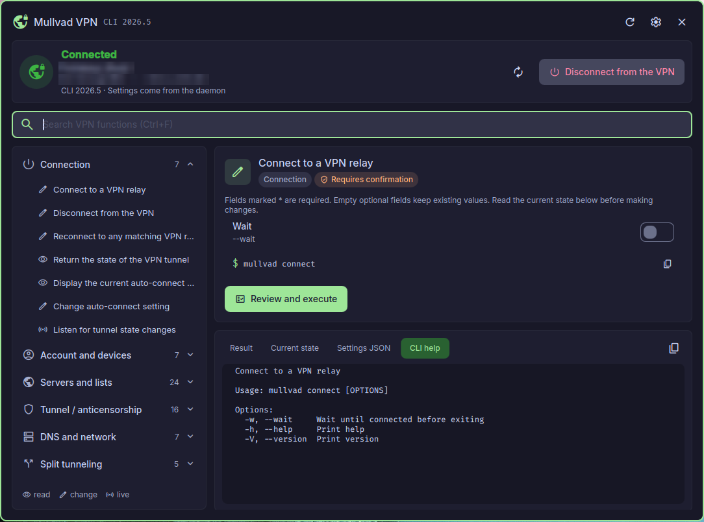
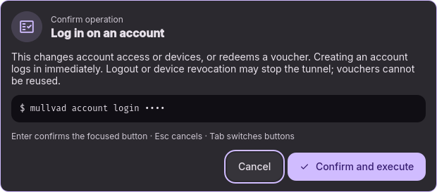
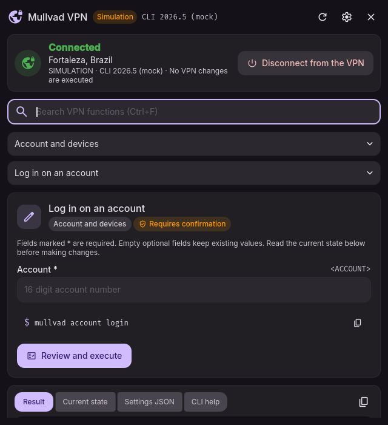

<div align="center">
  

# Dank Mullvad VPN

**The entire Mullvad VPN CLI, one click away in your DankBar.**

</div>

[](https://github.com/bernardopg/dms-mullvad-vpn-plugin/actions/workflows/check.yml)


A [DankMaterialShell](https://github.com/AvengeMedia/DankMaterialShell) plugin
that puts every `mullvad` command — **88 typed forms, 100% of CLI 2026.5** — behind
a native Material 3 interface. Connect, switch relays, tune DAITA, multihop,
anti-censorship, DNS blocking, split tunneling and API access without opening a
terminal, and without giving up the safety of the CLI.



## Highlights

- **Live status in the bar** — state color, city and relay, updated by
  `mullvad status --json listen`, with a polling fallback.
- **Full coverage** — connection, account and devices, vouchers, relays and
  overrides, custom lists, multihop, DAITA, quantum resistance, IPv6, MTU, key
  rotation, anti-censorship, DNS, LAN, lockdown, split tunneling,
  `mullvad-exclude`, API access proxies, logs, import/export and resets.
- **See exactly what runs** — every form previews the equivalent `mullvad`
  command (secrets masked), with one-click copy.
- **Safe by design** — every change needs a confirmation that repeats the
  command; destructive actions are flagged in red. No shell, no command console,
  argument arrays only, timeouts and process cleanup.
- **Credentials stay out of disk** — accounts, vouchers, passwords and private
  keys are never stored in DMS settings, and are redacted from all output.
  Private keys travel over stdin.
- **Built for the keyboard** — `Ctrl+F` search across all functions, `↑/↓` to
  pick, `Ctrl+Enter` to run, `Ctrl+R` to refresh, `Esc` to back out.
- **Native look** — DMS components and theme colors, light and dark, with a
  compact layout below 820 px.
- **English and Português (Brasil)**, following the DMS locale.
- **Zero extra dependencies** — Python 3 standard library only.



_Live capture on DankMaterialShell 1.6.2. Location, relay and IP are blurred._

| Confirmation                                    | Compact layout                        |
| ----------------------------------------------- | ------------------------------------- |
|  |  |

## Requirements

- DankMaterialShell **1.6.2+** with Quickshell
- Mullvad VPN **2026.5**, with `mullvad` (and `mullvad-exclude` for split
  tunneling) on the `PATH` of the DMS process, and the daemon running
- Python **3.10+**

Works on any distribution and any Wayland compositor supported by DMS.

## Install

**From DMS:** open _Settings → Plugins → Browse_, find **Dank Mullvad VPN** and
install it. Or run `dms plugins install dankMullvadVpn`.

**Manually:**

```sh
git clone https://github.com/bernardopg/dms-mullvad-vpn-plugin \
  ~/.config/DankMaterialShell/plugins/DankMullvadVPN
```

Then enable **Dank Mullvad VPN** in _Settings → Plugins_ and add the
`dankMullvadVpn` widget to your DankBar. No shell restart needed.

## Usage

- **Left click** the widget for the summary: status, relay, connect/disconnect.
- **Right click** (or _Open full window_) for the full interface: a navigation
  tree grouped by section, a typed form, and output tabs for the result, current
  daemon state, full settings JSON, CLI help and live logs.
- Fields marked `*` are required; empty optional fields keep current values.
  Variadic fields take space-separated values; application arguments take a
  JSON array such as `["--new-window", "https://example.org"]`.

### IPC

```sh
dms ipc call dankMullvadVpn toggle    # connect/disconnect (asks for confirmation)
dms ipc call dankMullvadVpn open      # open the full window
dms ipc call dankMullvadVpn settings  # open preferences
```

Bind them to keys in your compositor for instant access.

### Safety notes

Factory reset also removes the account login, caches and logs. Exports require
an absolute path, are written with `0600` permissions and **never overwrite** a
file. Imports accept only a JSON object and refuse symlinks. Mutations are never
retried: a timeout may happen after the daemon already applied a change.

## Troubleshooting

| Symptom              | Check                                                                                          |
| -------------------- | ---------------------------------------------------------------------------------------------- |
| Executable missing   | `mullvad --version` from the DMS environment — its `PATH` may differ from your terminal's.     |
| Daemon unavailable   | `systemctl status mullvad-daemon` and `mullvad status --json` as the DMS user.                 |
| Function unavailable | The adapter probes the installed CLI and disables unsupported forms. Target version is 2026.5. |
| Format changed       | The error names the parser. Update fixtures and parser only after checking real output.        |
| Adapter stopped      | Reload the plugin from DMS settings.                                                           |

## Development

```sh
scripts/check          # contracts, unit tests and a real DMS QML smoke test
scripts/check --core   # portable checks only (CI), no graphical session
DANK_MULLVAD_MOCK=1    # simulated backend: the UI shows SIMULATION, no VPN changes
```

The QML smoke test runs an isolated Quickshell instance with the real DMS
imports and the simulated backend; it never touches your running shell. Set
`DMS_QML_ROOT` if DMS is not found automatically.

See [CONTRIBUTING.md](CONTRIBUTING.md), [AGENTS.md](AGENTS.md) and the
Portuguese design docs: [architecture and security](docs/arquitetura.md),
[CLI coverage matrix](docs/matriz-cli.md) and
[manual validation checklist](docs/validacao-manual.md).

## License

[MIT](LICENSE). Community project, not affiliated with Mullvad VPN AB or
AvengeMedia.
