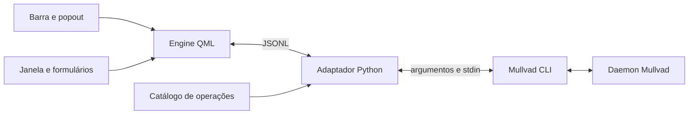

# Arquitetura, configuração e segurança

## Fluxo

`MullvadWidget.qml` estende `PluginComponent`, cria os componentes da barra e do
popout e compartilha um único `MullvadEngine.qml` entre todas as instâncias da
barra (várias telas ou barras), por meio do registro `Shared.js`. O engine
registra o único `IpcHandler` e mostra a confirmação na barra usada por último. A janela
`MullvadWindow.qml` usa componentes DMS e controles Qt com cores de `Theme`.
`OperationForm.qml` constrói um formulário tipado para a operação selecionada
em `operations.json`. O arquivo `MullvadSettings.qml` salva somente preferências
da interface, através do serviço de plugins.

A navegação é uma árvore seção/operação que filtra o catálogo por seção ou por
busca global traduzida. Abaixo de 820 px de largura, a janela usa seletores de
seção e operação em vez da árvore. `MullvadEngine.commandLine` gera apenas a
prévia exibida do comando; `backend.arguments` continua sendo a fonte autoritativa.
`MullvadButton.qml` adapta o tamanho implícito dos botões DMS aos layouts Qt,
mantendo o texto legível quando o idioma muda. Formulários usam `DankDropdown`,
`DankToggle` e `DankTextField`; a saída técnica fica em abas (`DankButtonGroup`) com texto monoespaçado.
O popout usa altura calculada pelo conteúdo e fecha antes de ativar a janela.
O engine é criado com uma URL versionada: a recarga de plugins do DMS 1.6.2
mantém tipos QML filhos em cache. Isso permite aplicar a versão 1.3.0 por IPC,
sem reiniciar a shell. Atualize essa URL quando publicar outra revisão do engine.
Consultas periódicas de status atualizam o resumo e as configurações atuais,
preservando o resultado da última ação do usuário. Falhas continuam visíveis.

O engine mantém um processo Python, envia JSONL por stdin e recebe respostas e
eventos por stdout. `backend.py` resolve `mullvad` no PATH, força saída inglesa
com `LC_ALL=C`, verifica a versão e a ajuda de cada operação (resultado em cache
em `~/.cache/dank-mullvad-vpn/probe.json`, invalidado quando o binário, a versão
do CLI ou o catálogo mudam), valida parâmetros
e executa uma lista de argumentos diretamente. Nenhum comando passa por shell.
O catálogo é fechado: não há operação para executar texto livre no CLI.
Eventos do daemon e ações confirmadas atualizam apenas as leituras afetadas,
agrupadas por um debounce de 500 ms. A consulta de 30 s só roda quando o fluxo
`status --json listen` está parado.



## Protocolo

Cada requisição contém `id` inteiro ou texto, `op` registrada, `params` objeto
e, para mutações, `confirmed: true`. Um exemplo de leitura:

```json
{ "id": 12, "op": "status", "params": {}, "confirmed": false }
```

Resposta de sucesso:

```json
{ "id": 12, "op": "status", "ok": true, "data": { "state": "disconnected" } }
```

Resposta de falha:

```json
{
  "id": 12,
  "op": "status",
  "ok": false,
  "error": { "code": "daemon", "detail": "…" }
}
```

Os eventos usam `event: "status.listen"` ou `event: "log.listen"`, `ok` e
`data`/`error`. Não têm ID de requisição. `init` retorna versão, catálogo e
disponibilidade; `snapshot` reúne leituras atuais; `stream.stop` encerra um
acompanhamento registrado. Esses comandos são internos ao engine, além das
operações documentadas na matriz.

Requisições com campos desconhecidos ou JSON inválido são recusadas. Há limite
de 1 MiB por linha de entrada e fila de 64 requisições. O worker serializa as
ações numa instância; todos os comandos finitos têm limite de 20 segundos.
Os streams são processos separados. Ao descarregar o plugin, o processo Python
recebe encerramento, interrompe os comandos ativos e termina os streams.
Aplicativos lançados por `mullvad-exclude` continuam vivos intencionalmente.

Uma execução pode aplicar a mudança no daemon antes de falhar ou atingir o
timeout. Por isso não há repetição automática das mutações; consulte o estado
antes de tentar novamente. Vários widgets/instâncias têm adaptadores separados:
a ordem global entre eles continua sendo responsabilidade do daemon. Para uma
ordem única no desktop, mantenha uma instância do widget.

## Validação e parsers

Os campos tipados validam enums, inteiros, portas, IPv4/IPv6, redes CIDR com bits
de host zerados, chaves base64 de 32 bytes, contas com 16 dígitos e caminhos
absolutos. Parâmetros opcionais mantêm a ordem posicional; hostname não pode
ser fornecido depois de uma cidade omitida. Valores não podem se transformar
em flags do CLI. Argumentos de aplicativos são uma lista JSON e permanecem
argumentos literais, inclusive quando contêm metacaracteres.

A opção de rotação aceita 24–720 horas ou `any`, conforme o tipo
`RotationInterval` do Mullvad 2026.5. MTU usa o intervalo do inteiro `u16` ou
`any`; o daemon aplica as restrições operacionais restantes. Nomes de cifras
Shadowsocks passam por validação sintática; o CLI decide quais estão disponíveis
na sua compilação. Nomes de novas listas/renomeações têm o limite de 30
caracteres. Autenticação SOCKS5 remota exige usuário e senha juntos.

O status usa JSON e verifica estados conhecidos. Leituras textuais verificam
os formatos do CLI. As opções `verbose` e `debug` são exclusivas; quando uma
delas é selecionada, o adaptador lê o diagnóstico nesse formato e consulta o
estado JSON separadamente. O monitor JSON distingue eventos de túnel das
notificações de configurações, listas, conta e métodos de API; notificações
disparam uma atualização do snapshot sem substituir o estado da conexão.

Os parsers textuais verificam
os cabeçalhos, campos e estruturas de saída inglesas. Há fixtures de leitura
real para políticas, DNS, restrições, relays, túnel, conta, dispositivos, API e
listas vazias. Casos adicionais simulam DNS próprio, proxies com credenciais,
listas populadas e conta revogada. Nomes livres de listas/dispositivos/métodos
continuam sendo texto: não se pode distinguir um nome arbitrário de uma mudança
de formato sem uma API estruturada. Formatos estruturais desconhecidos geram
erro `format`; nunca são convertidos silenciosamente em uma configuração.

Os comandos de mudança retornam a saída textual como resultado; o estado é
complementado por `export-settings -`, que retorna um objeto JSON sem gravar
arquivo e permite ler DAITA direto, userspace e demais configurações não
exibidas pelos getters. O snapshot remove credenciais antes de enviá-lo à UI.
O CLI não expõe getter para nível/filtro de logs; esses valores não são
apresentados como conhecidos.

O estado é consultado novamente após a resposta de uma mudança, inclusive erro
ou timeout. A janela apresenta a saída inglesa do CLI
como diagnóstico, sob cabeçalhos traduzidos. Para incluir um novo comando,
atualize a fixture de ajuda, o gerador revisado do catálogo, os idiomas, os
parsers relevantes, os testes e a matriz.

## Credenciais e arquivos

Contas, vouchers, senhas e chaves privadas não são salvos nas preferências DMS.
Campos sigilosos usam eco de senha e são limpos ao enviar. A confirmação mantém
os parâmetros apenas em memória, mostra marcadores no lugar dos segredos e os
descarta ao cancelar/executar. O histórico de requisições guarda só IDs e
operações. Respostas, eventos e erros passam por redaction; stderr do adaptador
não é encaminhado ao usuário. Logs da UI ficam limitados a 200 linhas de até
4096 caracteres, e não são gravados em disco.

O CLI exige alguns segredos como argumentos, como voucher e senha de proxy;
eles podem ficar visíveis temporariamente a ferramentas locais autorizadas de
inspeção de processos. O plugin não registra esses argumentos. A chave privada
de `relay set custom` é obrigatória no formulário e enviada **somente por stdin**.
Números de conta e chaves públicas são ocultados nas respostas da interface.
Ao criar uma conta real, o daemon mantém a conta; consulte o aplicativo oficial
para registrar o número de recuperação com segurança.

Importações aceitam somente objetos JSON, até 1 MiB, em arquivos normais sem
symlink. O adaptador lê o conteúdo e usa `mullvad import-settings -` por stdin.
Exportações usam `mullvad export-settings -`, validam o JSON e salvam num arquivo
temporário `0600` no mesmo diretório. Um hard link atômico cria o destino sem
sobrescrever; o temporário é removido mesmo se houver falha. O backup pode
conter dados de proxy: proteja-o como arquivo sensível. Exceções de arquivo/JSON
não incluem seu conteúdo nas mensagens.

## Traduções e acessibilidade

`Translations.qml` carrega catálogos por `FileView`, sem depender de acesso XHR.
A opção `auto` consulta o idioma do DMS (`SessionData.locale`), depois a
localidade Qt; idiomas sem catálogo usam inglês. São persistidas apenas as
chaves `language` e `showLocation`. O verificador exige igualdade de chaves e
placeholders nomeados `{nome}` em inglês/pt-BR.

Os controles têm nomes acessíveis, foco por Tab, botões com Enter/Espaço e
tooltips para ações principais. A confirmação mantém a navegação entre
cancelar/executar e Escape cancela. O estado possui texto e ícone além da cor;
carregamento, operação indisponível, erros e resultados são explícitos.
A confirmação é um `Dialog` modal, com captura de foco e bloqueio dos controles
ao fundo. Fechamento nativo e fechamento pela interface descartam parâmetros
pendentes e campos do formulário. `Ctrl+F` foca a busca e `Ctrl+R` atualiza leituras;
uma falha de inicialização ou saída do adaptador pode ser recuperada pelo botão
Atualizar, sem repetir mutações. A conexão rápida fica bloqueada nas transições.

## Organização e contribuição

O adaptador usa apenas Python padrão; a interface usa QtQuick, QtQuick.Controls,
Quickshell e módulos reais `qs.Common`, `qs.Widgets`, `qs.Modules.Plugins` do DMS.
O catálogo compartilhado evita duplicar a lista de argumentos nos formulários.
`scripts/discover_cli.py` consulta somente `--help` recursivamente para atualizar
a referência local. `scripts/read_only_probe.py` coleta somente leituras do CLI.
Essas atualizações são deliberadas; não fazem parte do teste normal.

Use `scripts/check`; verifique o relatório real e descreva mudanças em PRs como
comportamento observável. A convenção adotada neste repositório novo é
Conventional Commits. A CI portátil usa Python já disponível; o job gráfico
requer um runner preparado e execução manual pelo workflow. Nenhum teste
instala dependências automaticamente. A integração permanente à sessão DMS é
feita pelo operador nas configurações de plugins e da barra.
O teste isolado inicializa `DankCommon.Style.theme/settings` e o backend de
idioma como a shell real, evitando validar controles com o tema padrão de fallback.
